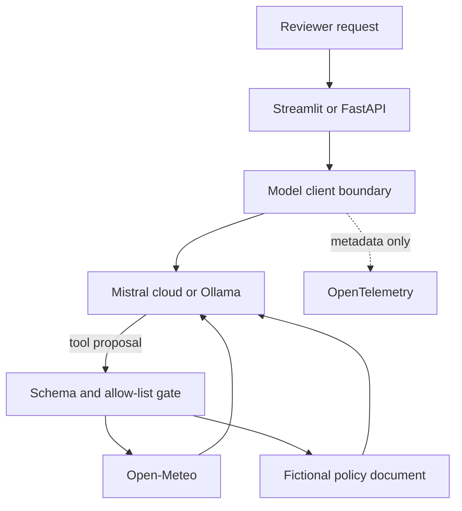

# Mistral Reliability Lab

[](https://github.com/Andreasniss/Mistral-playground/actions/workflows/ci.yml)
[](https://www.python.org/)
[](LICENSE)

A compact reference for building inspectable, tool-using AI with Mistral or local
Ollama models. The project makes the engineering around the model visible:
allow-listed tools, grounded answers, bounded retries, metadata-only tracing,
credential-free tests, and a deterministic evaluation contract.

> Portfolio scope: an applied-AI engineering reference, not a production service
> or a claim of model-quality benchmarking.

**Verified 31 August 2026:** Ruff passes, 26 credential-free tests pass, all 6 deterministic evaluation cases pass, and the locked runtime dependency audit reports no known vulnerabilities.

## What reviewers can verify

| Concern | Implementation | Evidence |
|---|---|---|
| Tool control | JSON schemas, application allow-list, bounded tool rounds | `demo_streamlit.py`, `llm_client.py` |
| Grounding | Fictional local policy document with named source sections | `showcase.py`, `RAG/hr_policy.md` |
| Resilience | Retry `429` and transient `5xx`, honor `Retry-After`, add jitter | `llm_client.py`, unit tests |
| Privacy | Prompt, response, arguments, and results excluded from logs/spans | `llm_client.py`, privacy regression tests |
| Observability | Opt-in OpenTelemetry with latency, usage, tool, and error metadata | `llm_client.py` |
| Regression safety | Secret-free CI, deterministic evals, locked dependency audit | `.github/workflows/ci.yml`, `evals/`, `uv.lock` |
| Provider choice | Mistral cloud or local Ollama through one client boundary | `config.py`, `llm_client.py` |

Related writing: [The Hard Part of Agentic AI Starts After the Demo](https://andreasnissen.dev/writing/agentic-ai-after-the-demo/) explains the production architecture around this reference. [How I Review AI-Built Public Work Without Outsourcing Judgment](https://andreasnissen.dev/writing/reviewing-ai-built-public-work/) explains the evidence and ownership standard applied to it.

## Try it in 60 seconds

The public UI automatically enters a clearly labelled, credential-free preview when
no provider is configured. It demonstrates routing and grounded policy answers
without faking a model call or live weather.

```bash
git clone https://github.com/Andreasniss/Mistral-playground.git
cd Mistral-playground
python3 -m venv .venv
source .venv/bin/activate
pip install -r requirements.txt
streamlit run demo_streamlit.py
```

Open `http://localhost:8501`, then choose one of the reviewer prompts.

For a locked, reproducible environment, use `uv sync --locked --dev` and
`uv run streamlit run demo_streamlit.py` instead.

## Connected mode

### Mistral cloud

```bash
cp .env.example .env
# Add MISTRAL_API_KEY to .env
streamlit run demo_streamlit.py
```

### Local model with Ollama

```bash
ollama pull mistral
LLM_BACKEND=local MISTRAL_MODEL=mistral streamlit run demo_streamlit.py
```

Connected mode sends every request to the model with both tools available. The model
proposes tool calls; application code validates the tool name against the allow-list,
executes it, appends the result, and asks the model for a grounded final answer.

## Architecture



Trust boundaries are intentional:

1. The model can propose a tool call but cannot register or execute arbitrary code.
2. Tool arguments must match a narrow JSON schema and an allow-listed function name.
3. Connected tools return data to the model; only the model's final text reaches the UI.
4. Logs and spans record operational metadata, not user or tool content.

See [SECURITY.md](SECURITY.md) for production gaps and security assumptions.

## Evaluation contract

Run the offline regression suite:

```bash
python -m pytest -q
python -m evals.run_evals
uv export --locked --no-dev --no-hashes --output-file /tmp/audit-requirements.txt
pip-audit --requirement /tmp/audit-requirements.txt --strict
```

The versioned cases check deterministic boundaries around the model:

- request route and expected tool;
- grounded policy facts and named sources;
- refusal to fabricate live weather in preview mode;
- explicit behavior for unsupported preview requests.

These checks do not measure model quality. A production extension should add versioned
provider runs, calibrated human labels, a failure taxonomy, and latency/cost thresholds.

## Other runnable surfaces

```bash
uvicorn api:app --host 127.0.0.1 --port 8000  # FastAPI + /docs
python demo_chat.py                           # Multi-turn CLI
python demo_tools.py --interactive             # Tool-call loop
python demo_structured.py                      # Typed JSON output
```

The FastAPI endpoints are intentionally local-only. `/chat` and `/summarize` require
an `X-API-Key` matching `API_KEY` in `.env`; `/health` is unauthenticated.

## Configuration

| Variable | Default | Purpose |
|---|---|---|
| `LLM_BACKEND` | `api` | `api` for Mistral or `local` for Ollama |
| `MISTRAL_MODEL` | `mistral-large-latest` | Provider model or Ollama model name |
| `MISTRAL_MAX_TOKENS` | `1024` | Maximum generated tokens |
| `MISTRAL_TEMPERATURE` | `0.0` | Deterministic-by-default sampling |
| `RETRY_MAX_ATTEMPTS` | `3` | Total attempts, including the first |
| `MAX_TOOL_ROUNDS` | `4` | Prevents unbounded model/tool loops |
| `REQUEST_TIMEOUT` | `30` | Local-provider request timeout in seconds |
| `OTEL_ENABLED` | `false` | Opt in to OTLP trace export |

Use a pinned model ID for repeatable evaluation runs; `latest` aliases are convenient
for exploration but can change behavior over time.

## Project map

```text
demo_streamlit.py   reviewer-facing UI and tool gate
llm_client.py       provider boundary, retry loop, tool loop, tracing
showcase.py         honest credential-free preview and retrieval
api.py              typed localhost-only HTTP surface
evals/              versioned deterministic evaluation contract
tests/              credential-free unit and privacy regression tests
RAG/hr_policy.md    synthetic grounding document
prompts/            version-controlled prompt templates
```

## Deliberate limits

- The policy corpus is tiny and synthetic; retrieval is transparent token overlap,
  not a vector database.
- Weather is the only live external tool.
- Authentication is suitable for a local demo, not a public multi-tenant endpoint.
- No claims are made about safety, correctness, or availability beyond the tested paths.

## Ownership and AI assistance

Andreas Nissen owns the project intent, architecture, requirements, evaluation criteria, risk decisions, and release decisions, and reviews merged changes. AI tools assisted with implementation and documentation. Automated and AI-assisted checks are evidence, not substitutes for human accountability.

This is a personal project. Views and opinions are Andreas's own and do not represent his employer.

Built by [Andreas Nissen](https://github.com/Andreasniss). See [andreasnissen.dev](https://andreasnissen.dev) and [connect on LinkedIn](https://www.linkedin.com/in/andreasnissen). Licensed under Apache 2.0.
