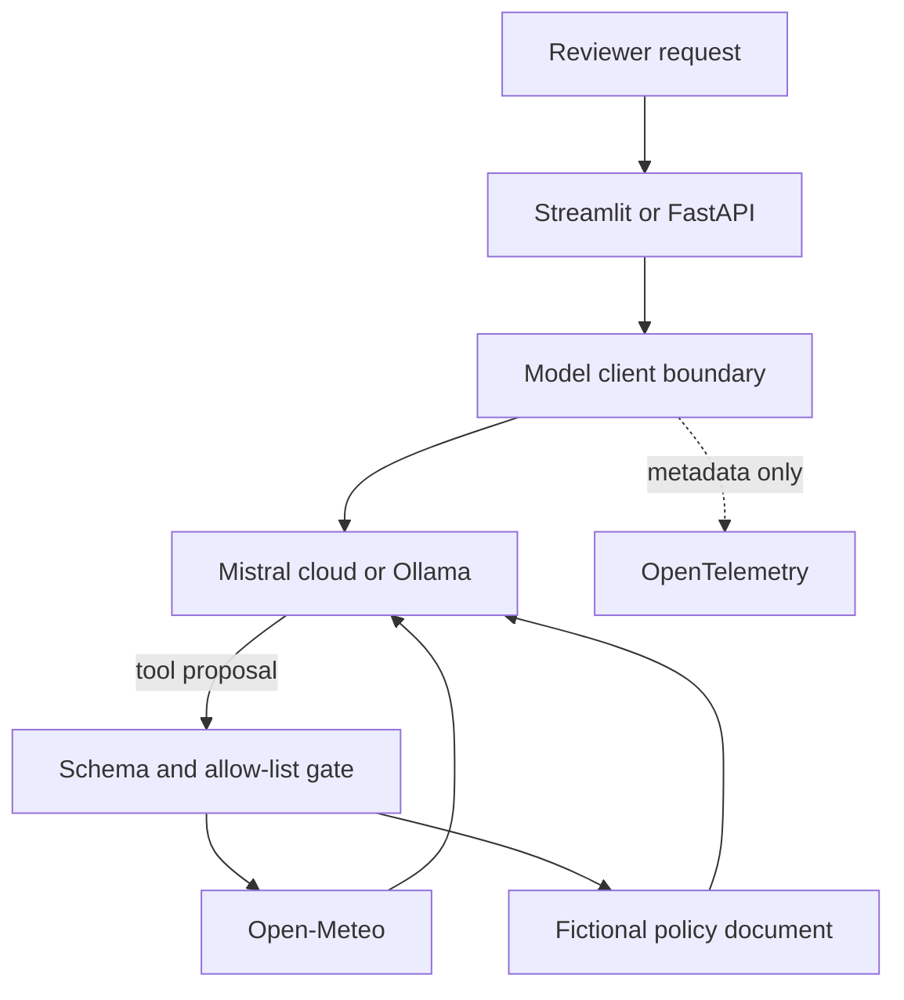

# Agent Reliability Lab

[Built by Andreas Nissen](https://github.com/Andreasniss) · [AndreasNissen.dev](https://andreasnissen.dev) · [Connect on LinkedIn](https://www.linkedin.com/in/andreasnissen) · [Source on GitHub](https://github.com/Andreasniss/Mistral-playground) · [Apache-2.0](LICENSE)

[](https://github.com/Andreasniss/Mistral-playground/actions/workflows/ci.yml)
[](https://www.python.org/)

A compact reference for building inspectable, tool-using AI with Mistral or local
Ollama models. The project makes the engineering around the model visible:
allow-listed tools, grounded answers, bounded retries, metadata-only tracing,
credential-free tests, and a deterministic evaluation contract.

> Portfolio scope: an applied-AI engineering reference, not a production service
> or a claim of model-quality benchmarking.

Start with the [credential-free preview](#try-the-credential-free-preview), or read the
[project walkthrough](https://andreasnissen.dev/projects/mistral-playground/) for the
reviewer path and trust boundaries. The repository slug `Mistral-playground` is
retained; the project is named **Agent Reliability Lab**.

**Verified 31 August 2026:** Ruff passes, 26 credential-free tests pass, all 6 deterministic evaluation cases pass, and the locked runtime dependency audit reports no known vulnerabilities.

## What reviewers can verify

| Concern | Implementation | Evidence |
|---|---|---|
| Tool control | JSON schemas, application allow-list, bounded tool rounds | `demo_streamlit.py`, `llm_client.py` |
| Grounding | Fictional local policy document with named source sections | `showcase.py`, `RAG/hr_policy.md` |
| Resilience | Retry `429` and transient `5xx`, honor `Retry-After`, add jitter | `llm_client.py`, unit tests |
| Privacy | Prompt, response, arguments, and results excluded from logs/spans | `llm_client.py`, privacy regression tests |
| Observability | Opt-in OpenTelemetry with latency, usage, tool, and error metadata | `llm_client.py` |
| Regression safety | Secret-free CI, deterministic evals, locked dependency audit | `.github/workflows/ci.yml`, `evals/`, `uv.lock` |
| Provider choice | Mistral cloud or local Ollama through one client boundary | `config.py`, `llm_client.py` |

## Try the credential-free preview

Prerequisites: Git, Python 3.12 or later, and
[uv](https://docs.astral.sh/uv/getting-started/installation/).
The lockfile selects the reviewed dependencies. Initial setup time depends on downloads.

```bash
git clone https://github.com/Andreasniss/Mistral-playground.git
cd Mistral-playground
uv sync --locked --dev
uv run streamlit run demo_streamlit.py
```

With no provider key configured, open `http://localhost:8501` and confirm the
**Credential-free preview** label. This mode makes no model or live-weather call.

1. Select **How many vacation days do employees receive?** Expect a summary citing
   the fictional policy, with the route, tool name, and **No provider call** visible.
2. Select **What is the weather in Munich?** Expect an explanation that live weather
   is disabled in preview.
3. Select **Clear conversation** in the sidebar to reset the conversation.

No local runtime? Inspect the [UI interaction tests](tests/test_streamlit_app.py)
and [versioned evaluation cases](evals/cases.json) for the same review path.

A pip-compatible setup remains available through `requirements.txt`; use a Python
3.12 virtual environment and install it there. The commands below use the locked
uv environment consistently.

## Connected mode

### Mistral cloud

```bash
cp .env.example .env
# Add MISTRAL_API_KEY to .env
uv run streamlit run demo_streamlit.py
```

### Local model with Ollama

```bash
ollama pull mistral
LLM_BACKEND=local MISTRAL_MODEL=mistral uv run streamlit run demo_streamlit.py
```

Connected mode sends every request to the model with both tools available. The model
proposes tool calls; application code validates the tool name against the allow-list,
executes it, appends the result, and asks the model for a grounded final answer.

## Architecture



Trust boundaries are intentional:

1. The model can propose a tool call but cannot register or execute arbitrary code.
2. Tool arguments must match a narrow JSON schema and an allow-listed function name.
3. Connected tools return data to the model; only the model's final text reaches the UI.
4. Logs and spans record operational metadata, not user or tool content.

See [SECURITY.md](SECURITY.md) for production gaps and security assumptions.

## Evaluation contract

Run the offline regression suite:

```bash
uv run ruff check .
uv run pytest -q
uv run python -m evals.run_evals
uv export --locked --no-dev --no-hashes --output-file /tmp/audit-requirements.txt
uv run pip-audit --requirement /tmp/audit-requirements.txt --strict
```

The versioned cases check deterministic boundaries around the model:

- request route and expected tool;
- grounded policy facts and named sources;
- refusal to fabricate live weather in preview mode;
- explicit behavior for unsupported preview requests.

These checks do not measure model quality. A production extension should add versioned
provider runs, calibrated human labels, a failure taxonomy, and latency/cost thresholds.

## Other runnable surfaces

```bash
uv run uvicorn api:app --host 127.0.0.1 --port 8000  # FastAPI + /docs
uv run python demo_chat.py                           # Multi-turn CLI
uv run python demo_tools.py --interactive             # Tool-call loop
uv run python demo_structured.py                      # Typed JSON output
```

The FastAPI endpoints are intentionally local-only. `/chat` and `/summarize` require
an `X-API-Key` matching `API_KEY` in `.env`; `/health` is unauthenticated.

## Configuration

| Variable | Default | Purpose |
|---|---|---|
| `LLM_BACKEND` | `api` | `api` for Mistral or `local` for Ollama |
| `MISTRAL_MODEL` | `mistral-large-latest` | Provider model or Ollama model name |
| `MISTRAL_MAX_TOKENS` | `1024` | Maximum generated tokens |
| `MISTRAL_TEMPERATURE` | `0.0` | Deterministic-by-default sampling |
| `RETRY_MAX_ATTEMPTS` | `3` | Total attempts, including the first |
| `MAX_TOOL_ROUNDS` | `4` | Prevents unbounded model/tool loops |
| `REQUEST_TIMEOUT` | `30` | Local-provider request timeout in seconds |
| `OTEL_ENABLED` | `false` | Opt in to OTLP trace export |

Use a pinned model ID for repeatable evaluation runs; `latest` aliases are convenient
for exploration but can change behavior over time.

## Project map

| Path | Purpose |
|---|---|
| [demo_streamlit.py](demo_streamlit.py) | Reviewer UI and tool gate |
| [llm_client.py](llm_client.py) | Provider boundary, retries, tool loop, tracing |
| [showcase.py](showcase.py) | Credential-free preview and retrieval |
| [api.py](api.py) | Typed localhost HTTP surface |
| [evals/](evals/) | Deterministic evaluation contract |
| [tests/](tests/) | Unit, privacy, and UI interaction tests |
| [RAG/hr_policy.md](RAG/hr_policy.md) | Synthetic grounding document |
| [prompts/](prompts/) | Version-controlled prompt templates |

## Deliberate limits

- The policy corpus is tiny and synthetic; retrieval is transparent token overlap,
  not a vector database.
- Weather is the only live external tool.
- Authentication is suitable for a local demo, not a public multi-tenant endpoint.
- No claims are made about safety, correctness, or availability beyond the tested paths.

## Ownership and AI assistance

Andreas Nissen owns the project intent, architecture, requirements, evaluation criteria, risk decisions, and release decisions, and reviews merged changes. AI tools assisted with implementation and documentation. Automated and AI-assisted checks are evidence, not substitutes for human accountability.

This is a personal project. Views and opinions are Andreas's own and do not represent his employer.

## Related writing

- [The Hard Part of Agentic AI Starts After the Demo](https://andreasnissen.dev/writing/agentic-ai-after-the-demo/): the production architecture beyond this reference.
- [How I Review AI-Built Public Work Without Outsourcing Judgment](https://andreasnissen.dev/writing/reviewing-ai-built-public-work/): the evidence and ownership standard applied here.

## Contributing and reuse

Read [CONTRIBUTING.md](CONTRIBUTING.md) for setup and verification, and
[PRIVACY.md](PRIVACY.md) before uploading changes. Install the local Git hooks as
documented there. Keep private authoring outside public branches and PRs.

Copyright 2026 Andreas Nissen. Original project code and accompanying technical
documentation are licensed under [Apache-2.0](LICENSE), except where separately
indicated. See [NOTICE](NOTICE). Third-party dependencies and bundled material
retain their own terms.
